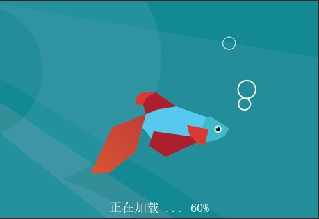
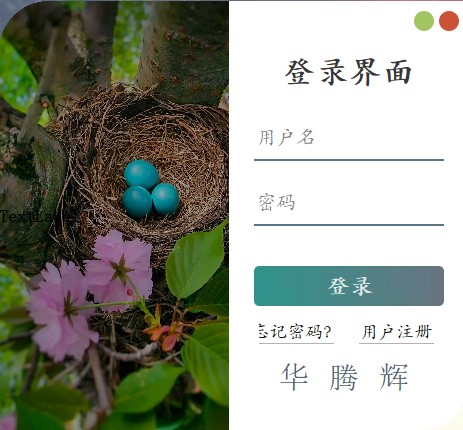
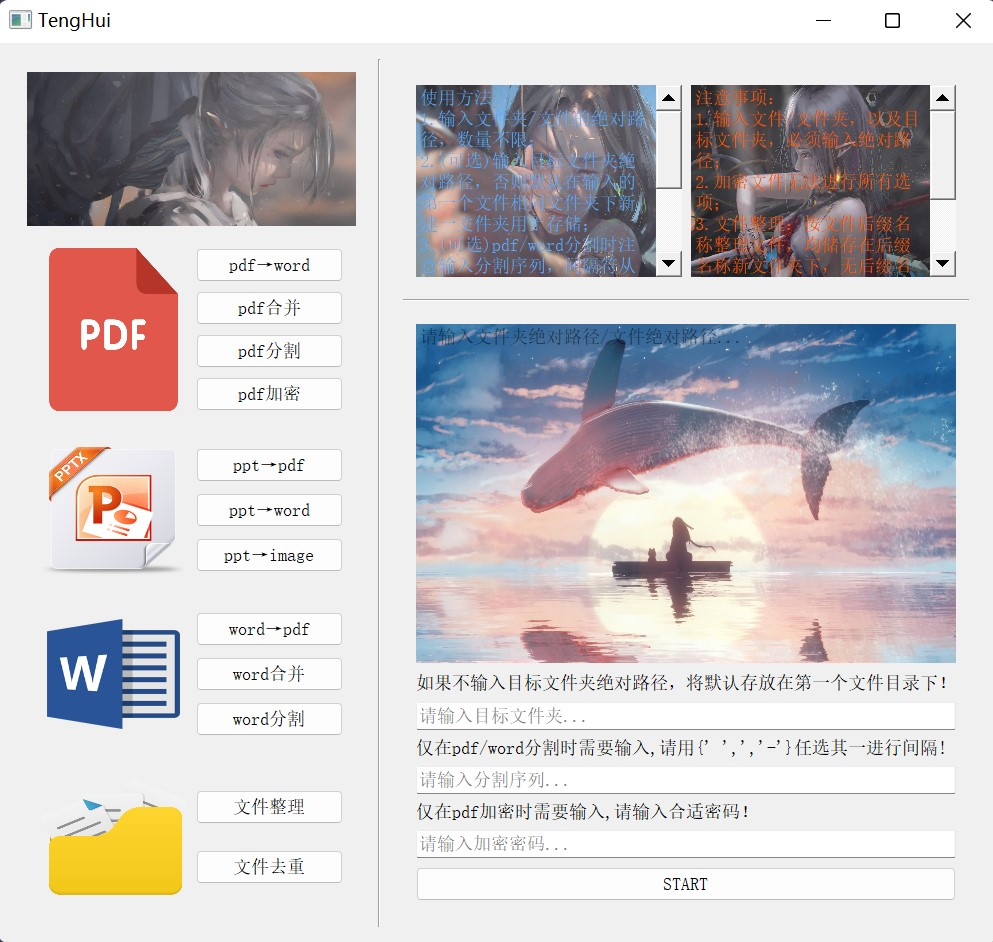

# TengHui FileHandler

## Interface Overview

- Loading
    
    
    
- Login
    
    
    
- APP
    
    
    

---

## Directory Structure

1. .idea:profile;
2. Main:
    - MainWindow.py:Software  main interface;
    - function.py:Software function implementation function;
3. pycache:profile;
4. images:
    - 1.jpg:Loading interface image;
    - 2.jpg:Login interface image;
    - 3.jpg:APP MainWindow interface image;
5. login:
    - app_rc.py:Load interface from .qrc to .py;
    - login_form.py:Login interface function;
    - splash.py:Load interface function;
    - ui_login:Login interface from .qrc to .py;
6. others:
    - mailbox:contact me;
    - username_password.txt:Account password;
    - help.md:Software help documentation;
7. resource:
    - resource.qrc:App MainWindow interface resource file;
    - resource.py:resource.qrc→resource.py by pyqrcc5;
    - others:resource images;
8. ui:
    - login-form.ui:Login interface;
    - main ui:APP MainWindow interface;
    - ui_main.py:main ui →ui_main.py by pyside2_uic;
9. APP.py:Main control program;

---

## Required Package

1. interface:
- PyQt5-5.15.6;
- PyQtDesigner-5.14.1;
- pyqrc-1.0.3;
2. function:
- PyPDF2-1.27.12;
- docx2pdf-0.1.8;
- pdf2docx-0.5.3;
- python-docx-0.8.11;
- python-pptx-0.6.21;
